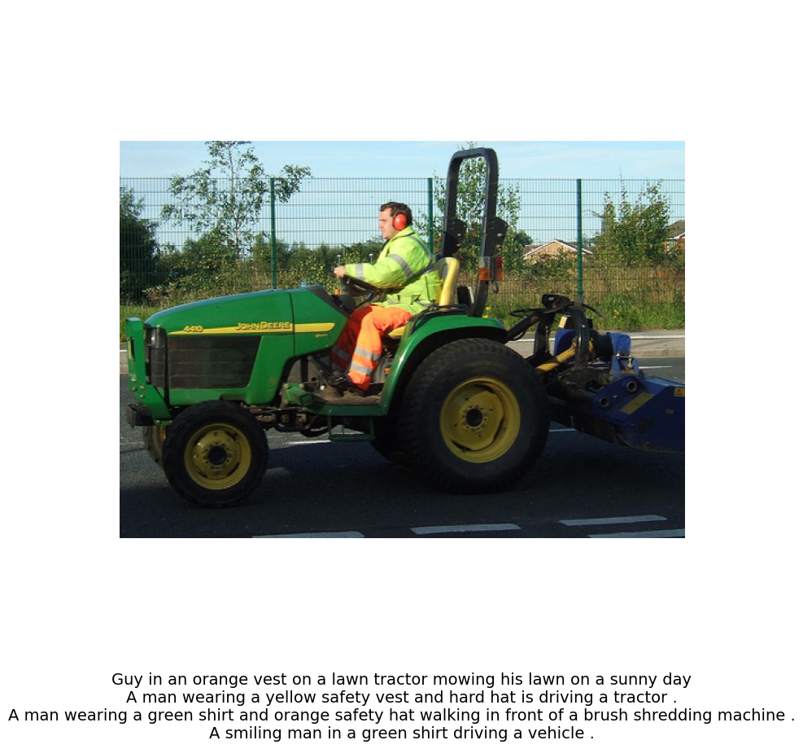

## OpenAI CLIP (Contrastive Language-Image Pretraining) 
* * * 
***CLIP is an open source, multi-modal, zero-shot model. Given an image and text descriptions, the model can predict the most relevant text description for that image, without optimizing for a particular task.***

<u>Key Features of CLIP:</u>

*Bridging Vision and Language:* CLIP represents a major leap in AI research as it bridges the divide between vision and language understanding. This allows it to understand images in context of natural language descriptions.

*Zero-Shot Learning:* One of the most powerful features of CLIP is its ability to perform zero-shot learning. This means that it doesn't need task-specific fine-tuning to work on a new task. It can understand and generate responses based on prompts that are provided in natural language. This generalizability is a key strength.

*Versatility:* CLIP can perform a wide variety of tasks, ranging from object recognition to generating captions for images, without any extra training.


**Contrastive Pre-training** :: [Source](https://vinija.ai/models/CLIP/) 

* * * 
CLIP model is a zero-shot, multi-modal model that uses contrastive loss for pre-training. Contrastive loss is a technique used during the pretraining of models like CLIP to help them learn representations that bring together related instances and push apart unrelated ones. In the case of CLIP, the model is trained on pairs of images and text, and the goal is to make the model understand and correctly match the pairs. The contrastive loss function helps in this process.

<p align="center" width="100%">
    
</p>

Assume we have a batch of N images paired with their respective descriptions e.g. ```<image1, text1>```, ```<image2, text2>```, ```<imageN, textN>```.

Contrastive Pre-training aims to jointly train an Image and a Text Encoder that produce image embeddings ```[I1, I2 … IN]``` and text embeddings ```[T1, T2 … TN]```, in a way that:

- The cosine similarities of the correct ```<image-text>``` embedding pairs ```<I1,T1>```, ```<I2,T2>``` (where ```i=j```) are maximized.

- In a contrastive fashion, the cosine similarities of dissimilar pairs ```<I1,T2>```, ```<I1,T3>… <Ii,Tj>``` (where ```i≠j```) are minimized.

<u>Learning Process</u> ::
[Source](https://vinija.ai/models/CLIP/)

Here’s a step-by-step breakdown of how CLIP works:

1. The model receives a batch of (image,text)
 pairs.

2. The text encoder is a standard Transformer model, say GPT2. The image encoder can be either a ResNet or a Vision Transformer.

3. For every image in the batch, the Image Encoder computes an image vector. The first image corresponds to the I1 vector, the second to I2, and so on. Each vector is of size de, where de is the size of the latent dimension. Hence, the output of this step is N× de matrix.
4. Similarly, the textual descriptions are squashed into text embeddings [‘T1‘,‘T2‘,...,‘TN‘]
, producing a N×
 de matrix.
5. Finally, we multiply those matrices and calculate the pairwise cosine similarities between every image and text description. This produces an N×N
 matrix.
6. The goal is to maximize the cosine similarity along the diagonal - these are the correct ```(image, text)``` pairs. In a contrastive fashion, off-diagonal elements should have their similarities minimized (e.g., I1 image is described by T1 and not by T2, T3, T4, etc).
A few extra remarks:

- The model uses the symmetric cross-entropy loss as its optimization objective. This type of loss minimizes both the image-to-text direction as well as the text-to-image direction (remember, our contrastive loss matrix keeps both the (I1, T2) and (I2, T1) cosine similarities).
- Contrastive pre-training is not entirely new. It was introduced in previous models and was simply adapted by CLIP.

<u>Zero-Shot CLIP</u>


<p align="center" width="100%">
    
</p>

We have now pre-trained our Image and Text Encoders, and we are ready for Zero-Shot Classification.<br>
The above image shows how CLIP works for zero-shot prediction:
- Per usual, we provide a text caption and an image that are encoded into text and image embeddings, respectively.
- CLIP will then compute the pairwise cosine similarities between the image and text embeddings and choose the text with the highest similarity as the prediction.
- CLIP also caches the input text embeddings as to save on compute for the rest of the input images.


<h3 align='center'> Implementation Details </h3>

```
Setup:
step 1: pip install -r requirements.txt
To download the dataset, at first, download the kaggle.json file from your kaggle profile and put it in the project directory.

setp 2: python data.py

step 3: python train.py
```

Image Encoder:
[Link](https://huggingface.co/timm/vit_base_patch16_224.augreg2_in21k_ft_in1k) 
```
Model : vit_base_patch16_224.augreg2_in21k_ft_in1k

Embedding Dim: 1000

Params (M): 86.6
GMACs: 16.9
Activations (M): 16.5
Image size: 224 x 224
```

Text Encoder:
[Link](https://huggingface.co/sentence-transformers/bert-base-nli-mean-tokens) 
```
Model : sentence-transformers/bert-base-nli-mean-tokens

Embedding Dim: 766

SentenceTransformer(
  (0): Transformer({'max_seq_length': 128, 'do_lower_case': False}) with Transformer model: BertModel 
  (1): Pooling({'word_embedding_dimension': 768, 'pooling_mode_cls_token': False, 'pooling_mode_mean_tokens': True, 'pooling_mode_max_tokens': False, 'pooling_mode_mean_sqrt_len_tokens': False})
)
```
<h3 align='center'> Results </h3>

* * * 
<h4 align='center'> Text to image  </h4>
<p align="center" width="100%">
    
</p>
<p align="center" width="100%">
    
</p>
<p align="center" width="100%">
    
</p>
<p align="center" width="100%">
    
</p>


<h4 align='center'> Image to Text</h4>

<p align="center" width="100%">
    
</p>
<p align="center" width="100%">
    
</p>
